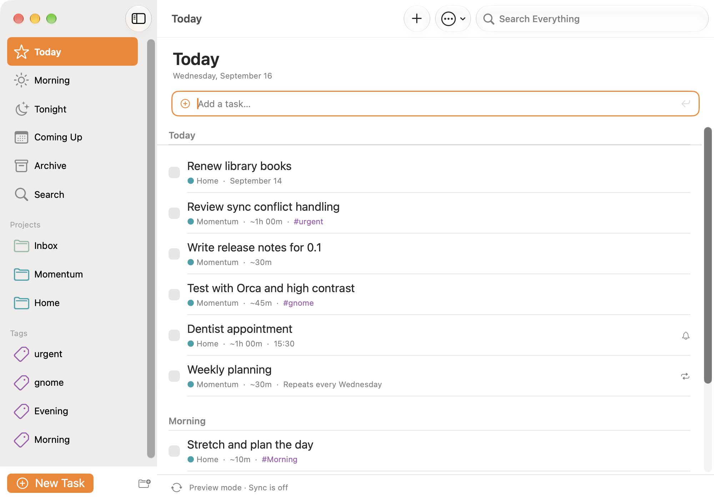
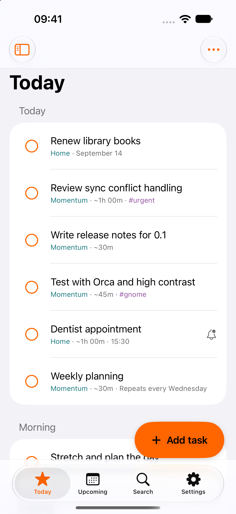

<p align="center">
  
</p>

<h1 align="center">Momentum</h1>

<p align="center">
  <a href="https://github.com/dan-hart/momentum/actions/workflows/ci.yml"></a>
  <a href="LICENSE"></a>
  <a href="crates/momentum-core"></a>
  <a href="macos/README.md"></a>
</p>

<p align="center">
  <a href="#install"></a>
  <a href="macos/README.md"></a>
  <a href="ios/README.md"></a>
</p>

<p align="center">
  <strong>Plan your day. Native task planning, one shared core, and your data under your control.</strong>
</p>

Momentum is an offline-first task planner with native interfaces for Linux and
macOS, an iOS/iPadOS app in development, and Android planned. Core task management
works without an account or internet connection. One Rust engine owns task rules,
queries, persistence, recurrence, undo and sync; each app owns its native interface
and system integrations.

Momentum is GPL-3.0-or-later and remains free to build, compile, self-host and use
from source. There are no ads, tracking or analytics. Pricing for future official
distributions is undecided; no subscription or tipping integration is implemented.

## Native previews

These macOS and iOS captures use the built-in sample data in **preview mode**, with
sync disabled. They show development builds, not a claim of completed platform
parity or accessibility acceptance. Capture details are in the
[screenshot notes](data/resources/screenshots/README.md).

### macOS

<p align="center">
  
</p>

### iOS

<p align="center">
  
</p>

<details>
<summary>Linux preview</summary>

<p align="center">
  
</p>

The Linux image is an earlier preview; current grouping behavior is described below.

</details>

## Platform status · September 18, 2026

| Platform | Native app | Current status |
|---|---|---|
| Linux | Rust, GTK 4 and libadwaita | Established MVP. Recent sync/grouping changes still have Linux runtime checks outstanding. |
| macOS | SwiftUI with AppKit and system services | Established MVP with local builds and scoped native acceptance. Some integrations and real-device sync checks remain open. |
| iOS / iPadOS | Swift and SwiftUI through UniFFI | In progress for iOS 26 and 27. Core task flows and Settings run natively; full macOS feature parity is the completion target. |
| Android | Planned native frontend to the same Rust core | No app implementation yet. |

The [feature ledger](docs/FEATURES.md), [known issues](docs/BUGS.md) and
[progress log](docs/PROGRESS.md) distinguish implementation from verification.
See the [iOS parity checklist](docs/IOS-PARITY-CHECKLIST.md) for the remaining work.
Current iOS sync delivery includes Nextcloud and LibreSync. The ledger keeps hosted
Nextcloud and separate-device Bonjour acceptance visible instead of treating local
simulator transport as proof of those system boundaries.

## Decisions and updates · September 16–18, 2026

- **Share behavior, keep interfaces native.** Linux calls the Rust engine directly;
  Apple apps use generated UniFFI bindings and reusable Swift support. Layout,
  navigation, gestures, accessibility and OS services belong to each platform.
- **Four iOS tabs:** Today, Upcoming, Search and Settings. Projects, tags,
  Morning/Evening and Archive are reached through Lists. Settings is organized into
  Task Lists, Appearance, Notifications, Sync, Backups and About.
- **A consistent mobile appearance.** The default accent remains exactly `#FF6600`
  in light and dark mode. All filled default-orange buttons use white text and
  symbols; Increase Contrast is the only exception and uses calculated ink. Settings
  offers AsNeeded's nine curated DHFlatUIColors choices in one list without country
  groupings. SF Symbols, restrained motion/haptics and a full-bleed app icon are part
  of the native design. Custom colors adapt for contrast; exact orange still has
  known foreground-contrast limitations.
- **Native Mac controls.** SwiftUI/AppKit navigation, system font selection with
  separate content/interface sizes, centered task controls, Keychain storage,
  Spotlight and Shortcuts integrations, a menu bar item and the bundled `mo` CLI.
  Integration-specific verification limits remain in the platform ledger.
- **Shared Apple automation.** iOS uses the Mac App Intents for create, find,
  complete/reopen, plan Today and open, with the same task parameters and Rust rules.
  URL entry and actual Shortcuts Create Task pass on iOS 26.5 and 27; other system
  actions and background/locked-device acceptance remain open. See the
  [automation guide](ios/README.md#automation).
- **One grouping layer.** Morning & Night is the default. Project, first tag, time
  estimate or None replaces that grouping; completed tasks stay separate. Saved
  grouping choices are preserved. See [Grouping](docs/GROUPING.md).
- **Optional sync, one provider at a time.** Off, Nextcloud or LibreSync on desktop;
  switching preserves tasks and saved connections. iOS now has native Nextcloud
  setup, checked Keychain storage, manual/foreground automatic sync and persistent
  recovery actions. Native loopback WebDAV checks cover convergence, encrypted files,
  conflict retry and cancellation. Connection validation requires HTTPS outside
  localhost and preserves the previous Keychain record after invalid input.
  Hosted-server acceptance remains open. iOS also exposes LibreSync pairing,
  discovery, linked-device management, manual sync and recovery. Disposable peers
  converge through the real Swift/UniFFI/Rust transport on iOS 26.5 and 27;
  separate-device Bonjour interaction remains open.
- **Native iOS backups.** Export JSON through Files, or select a compatible backup
  and explicitly confirm replacement. Failed imports preserve existing tasks and
  keep the selected backup available for retry.
- **Notifications on your terms.** Morning summary is opt-in, with a configurable
  local time initially set to 08:00. iOS has bounded reminder/summary planning,
  notification controls and shared badge-count rules. Simulator delivery/actions
  pass, and the background handler is covered directly; a scheduler-originated wake
  remains a system acceptance boundary.
- **Low Power Mode respects the battery.** iOS pauses automatic Nextcloud, Spotlight
  and discretionary notification refresh work while keeping manual sync, local edits
  and scheduled notifications available. Automatic work resumes with normal power.
- **Accessibility is required and still being verified.** The
  [iOS audit](docs/audits/2026-09-16-ios-accessibility.md) covers source review and
  native iPhone/iPad checks. Contrast, accessibility-size layout, task targets,
  feedback, subtask semantics and keyboard action routing have focused regressions.
  Voice Control and Switch Control retain live system acceptance; VoiceOver was
  explicitly excluded from the current completion scope.
- **Preserve compatibility while planning v2.** Current Super Productivity data and
  Nextcloud interoperability remain in place. An independent future format,
  migrations and continued interoperability have not been decided.
- **Open-source freedom remains.** Optional official-distribution subscriptions
  and tipping are future ideas, including RevenueCat on Apple platforms. Pricing,
  entitlements and rollout are undecided; no billing SDK is being added now, and
  self-built/self-hosted use stays free.

## Task-planning highlights

These describe the established desktop baseline. iOS capability and acceptance
vary by feature; use the platform ledger above for exact scope.

- **Today, Morning, Tonight, Coming Up, projects and tags.** Today is the plan, with a
  morning section for tasks tagged "Morning" and an evening one for "Evening" in the default grouping.
  Those sidebar entries appear only on days that use them. Coming Up shows the next
  7 or 30 days using your selected grouping, with dates on task rows. Projects and
  tags are one click away in the desktop sidebar.
- **Guided task creation.** Title, project, due day with a calendar, estimate, tag chips
  and notes in one dialog. Or type `Fix the bug #work 1h 30m` into the quick-add box, with
  `#` autocomplete for your tags.
- **Repeating tasks.** Create and edit daily, weekly, monthly and yearly schedules, and the
  ones from Super Productivity spawn their instances here too, badged with a plain-language
  "Repeats every Monday".
- **Sync you can trust.** Compatible with Super Productivity's `sync-data.json`, including
  end-to-end encrypted files. Conflicts are resolved by rebasing your changes, never by
  overwriting. Secrets live in the system keyring.
- **Or no server at all.** Link two devices once with a six-digit code and they sync
  directly over the local network, end-to-end encrypted, seconds after a change. Choose LibreSync as your
  sync provider; switching back to Nextcloud preserves your tasks and connections.
- **Times, reminders, overdue.** Give a task a time and a reminder; what slipped waits
  under an Overdue heading, and a repeating task you missed still shows up, dated the day
  it was due.
- **Fast search over everything.** Tasks, notes, subtasks, the archive, projects and tags,
  grouped and instant.
- **Drag and drop, multi-select, bulk edit.** Drop a task on a project, a tag, Today or
  Tonight. Ctrl+click or the select toggle to pick several, then drag them together or
  mark done, plan, move, tag or delete them in one go, with a single Undo.
- **Keyboard first.** Standard GNOME shortcuts, a shortcuts dialog, context menus on
  everything, and system-wide shortcuts through the GlobalShortcuts portal.
- **Undo, not confirmation.** Delete, done, archive, moves and tag drops all get an Undo
  toast. Prefer a clean list? Turn on "Archive completed tasks immediately" in
  Preferences and completed tasks go straight to the archive.
- **Native, adaptive, accessible.** Sidebar collapses on narrow windows, light and dark
  follow the system, accent color follows your setting, controls carry accessible labels,
  and Preferences offers a native font chooser with separate content and interface sizes.

<p align="center">
  
  
</p>

## Install

### macOS

```sh
brew install --cask dan-hart/tap/momentum
```

The cask installs the app and puts its `mo` command line on your PATH. The same
`Momentum-vX.Y.Z-macos.zip` is attached to every
[release](https://github.com/dan-hart/momentum/releases/latest). Momentum needs macOS 26.
To build it yourself instead (Xcode 27 and a Rust toolchain):

```sh
brew install xcodegen
cd macos && xcodegen generate && open Momentum.xcodeproj
```

### iOS / iPadOS

Build from source with Xcode 27, XcodeGen and the Rust iOS targets. The minimum
deployment target is iOS/iPadOS 26. See the [iOS build guide](ios/README.md) for
device/simulator builds and signing. Release readiness is tracked in the parity
checklist; a development build does not establish feature parity.

### Linux

**One click:** open [dan-hart.github.io/momentum](https://dan-hart.github.io/momentum/) and press
Install. GNOME Software or KDE Discover adds Momentum's repository and keeps it updated.

**Terminal:**

```sh
flatpak install --user https://dan-hart.github.io/momentum/momentum.flatpakref
```

Momentum publishes to its own signed Flatpak repository for x86_64 and aarch64, so it
works on any distribution with Flatpak: GNOME, KDE Plasma, Sway and the rest. Standalone
`.flatpak` bundles are also attached to each
[release](https://github.com/dan-hart/momentum/releases/latest) for offline installs.

### The `mo` command line on its own

```sh
brew install dan-hart/tap/momentum-cli       # macOS or Linux; prebuilt, no toolchain needed
```

On macOS the app already includes `mo`, so install one or the other. Every release also
attaches `mo-vX.Y.Z-{macos-universal,linux-x86_64,linux-aarch64}.tar.gz`.

### Set up sync

1. In Super Productivity, note the Nextcloud folder and encryption password you use.
2. In Momentum, press <kbd>Ctrl</kbd>+<kbd>,</kbd>, choose **Sync → Nextcloud**, and
   enter the server URL, username, an app password (Nextcloud → Settings → Security), the
   folder, and the encryption password.
3. Press <kbd>Ctrl</kbd>+<kbd>R</kbd>. The first sync only downloads, so it is safe to try.

The last sync time shows under the task list. Sync also runs at startup and every five
minutes while the switch is on.

### Set up iOS sync

In **Settings → Sync**, choose **Sync Provider → Nextcloud**. Enter your server URL,
username, app password and sync folder, then choose **Save Connection**. Use the same
folder and encryption password on every device. Remote servers require HTTPS; HTTP is
accepted only for an isolated localhost fixture. **Sync Now**, last successful sync,
pending changes and error recovery are available on this screen.

Automatic sync runs while Momentum is open. Leaving the app stops the exchange;
Low Power Mode pauses automatic checks but keeps Sync Now available. Local changes
stay on the device for the next sync. Choosing **Off** preserves your
tasks and saved connection. See the [iOS sync guide](ios/README.md#nextcloud-sync)
for verification limits.

### Sync desktop devices nearby

No server? Preferences/Settings → Sync → **LibreSync** on two machines,
open **Manage Devices…** on both, and type one device's six-digit code on the other. From
then on changes travel directly over the local network, end-to-end encrypted, a few
seconds after you make them. Only the selected provider runs. Switching to Nextcloud later keeps the received
changes and saved connections. Details in
[docs/P2P.md](docs/P2P.md).

## Linux desktop integration

- **Search from the shell.** Type a task name in GNOME's Activities overview or KDE's KRunner
  to find it or create it. Momentum registers a GNOME search provider and a KRunner plugin.
- **Notifications you can act on.** Reminders have Done and Snooze buttons, and a morning
  summary tells you what the day holds.
- **Runs in the background.** Turn it on in Preferences: reminders and sync keep going when
  the window closes, Momentum starts at login, and GNOME's Background Apps menu can show tasks
  due today, all open tasks in Today (including overdue), or a neutral running status. All
  through the Background portal, so you stay in control.
- **Launcher actions.** Right-click the app icon for New Task, Today and Search.
- **Quick-add window.** Ctrl+Alt+T from anywhere opens a one-line window; type, Enter, done.
- **Drop and paste.** Drag a link or some text from another app onto the list to make a task;
  paste several lines into the add box to create several tasks.
- **Links and scripts.** `momentum --add "Call the bank"` from a script, or open
  `momentum://add?title=Call%20the%20bank` and Super Productivity's
  `superproductivity://create-task` links.
- **Global undo.** Ctrl+Z reverses the last change, even after its toast is gone.

## The `mo` command line

`mo` works on Linux and macOS and reads the same data as the app. On Linux, while the app
is running, changes are handed to it over D-Bus so nothing is written behind its back.
`mo open` is Linux-only; on macOS, use the Momentum **Open Task** Shortcut instead.

```sh
brew install dan-hart/tap/momentum-cli   # or: cargo install --path crates/mo, or flatpak run --command=mo io.github.dan_hart.Momentum …

mo add "Call the bank #admin 15m" --today
mo add "Prep slides" --project Work --tomorrow
mo today            mo tonight            mo upcoming --days 14
mo list Work        mo list "#admin"       mo search bank
mo done bank        mo plan slides         mo rm 01a0835a
mo open bank
mo projects         mo tags               mo sync
mo config --server https://cloud.example.com --user dan --folder super-productivity --password
```

Add `--json` for machine-readable output. Set `MO_DATA_DIR` to point at another store.
For safety, Linux `mo open` accepts only the exact stable or Devel Flatpak store path;
it refuses custom data directories because they cannot be mapped to one app instance.
See [Linux automation](docs/LINUX-AUTOMATION.md) for exact task opening, JSON contracts,
offline/live-app safety rules, native entry points, and their regression-test audit.

## Desktop keyboard shortcuts

Ctrl is the default modifier. Preferences › Desktop › **Modifier key** switches every
shortcut below to Alt or Super (Option or Command on macOS), so Ctrl+E becomes Super+E.

| Shortcut | Action |
|---|---|
| <kbd>Ctrl</kbd>+<kbd>N</kbd> | New task |
| <kbd>Ctrl</kbd>+<kbd>Shift</kbd>+<kbd>N</kbd> | New project |
| <kbd>Ctrl</kbd>+<kbd>Shift</kbd>+<kbd>M</kbd> | Move task to the morning / back to today |
| <kbd>Ctrl</kbd>+<kbd>F</kbd> | Search |
| <kbd>Ctrl</kbd>+<kbd>D</kbd> | Mark focused task done / not done |
| <kbd>Ctrl</kbd>+<kbd>T</kbd> | Plan focused task for today |
| <kbd>Ctrl</kbd>+<kbd>Shift</kbd>+<kbd>T</kbd> | Move between Today and Tonight |
| <kbd>Ctrl</kbd>+<kbd>Shift</kbd>+<kbd>→</kbd> | Move to tomorrow |
| <kbd>Ctrl</kbd>+<kbd>Shift</kbd>+<kbd>↓</kbd> | Move to next week (Monday) |
| <kbd>Ctrl</kbd>+<kbd>Shift</kbd>+<kbd>R</kbd> | Repeat schedule |
| <kbd>Ctrl</kbd>+<kbd>Z</kbd> | Undo the last change |
| <kbd>Ctrl</kbd>+<kbd>M</kbd> | Move focused task to a project |
| <kbd>Delete</kbd> | Delete focused task |
| <kbd>Ctrl</kbd>+<kbd>A</kbd> | Select all tasks in the view |
| <kbd>Ctrl</kbd>+<kbd>E</kbd> | Archive completed tasks |
| <kbd>Ctrl</kbd>+<kbd>Up</kbd> / <kbd>Ctrl</kbd>+<kbd>Down</kbd> | Move focused task up / down (Manual Order) |
| <kbd>Ctrl</kbd>+<kbd>Shift</kbd>+<kbd>D</kbd> | Duplicate focused task |
| <kbd>Ctrl</kbd>+<kbd>Shift</kbd>+<kbd>C</kbd> | Copy focused task title |
| <kbd>Ctrl</kbd>+<kbd>O</kbd> | Open focused task details |
| <kbd>Ctrl</kbd>+<kbd>Shift</kbd>+<kbd>A</kbd> | Clear selection |
| <kbd>Ctrl</kbd>+<kbd>L</kbd> | Focus the quick-add box |
| <kbd>F9</kbd> | Show or hide the sidebar |
| <kbd>Ctrl</kbd>+<kbd>PageDown</kbd> / <kbd>Ctrl</kbd>+<kbd>PageUp</kbd> | Next / previous view |
| <kbd>Alt</kbd>+<kbd>1</kbd>…<kbd>9</kbd> | Jump to a sidebar entry |
| <kbd>Ctrl</kbd>+<kbd>R</kbd> / <kbd>F5</kbd> | Sync now |
| <kbd>Ctrl</kbd>+<kbd>,</kbd> | Preferences |
| <kbd>Ctrl</kbd>+<kbd>?</kbd> | All shortcuts |
| <kbd>Ctrl</kbd>+<kbd>Alt</kbd>+<kbd>T</kbd> | System-wide: add a task from anywhere |

## Build from source

For Apple builds, use the [macOS](macos/README.md) or [iOS](ios/README.md) guide.
The iOS regression suite is unit-only: portable Swift tests cover code and a minimal
simulator host renders the production SwiftUI views with `UIHostingController`. It has
no XCUITest target and does not use ViewInspector; see the
[fast iOS testing guide](ios/TESTING.md).
The Linux app builds as a Flatpak against the GNOME 50 SDK. You need `flatpak` and the
`org.flatpak.Builder` app.

```sh
flatpak install --user flathub org.gnome.Sdk//50 org.gnome.Platform//50 \
  org.freedesktop.Sdk.Extension.rust-stable//25.08 \
  org.freedesktop.Sdk.Extension.llvm22//25.08 org.flatpak.Builder

# Nearby-device sync links against LibreSync, checked out next to the workspace
git clone https://github.com/dan-hart/LibreSync ../LibreSync && ln -s ../LibreSync libresync-src

# Development build (striped header, debug logging, separate data)
flatpak run org.flatpak.Builder --user --install --force-clean flatpak_app \
  build-aux/io.github.dan_hart.Momentum.Devel.json
flatpak run io.github.dan_hart.Momentum.Devel

# Release build
flatpak run org.flatpak.Builder --user --install --force-clean flatpak_app_release \
  build-aux/io.github.dan_hart.Momentum.json
```

Or open the folder in GNOME Builder and press Run.

### Repository layout

| Path | What |
|---|---|
| `crates/momentum-core` | Shared task engine, queries, mutations, undo, notifications and sync orchestration |
| `crates/momentum-ffi` | Generated UniFFI boundary for native clients |
| `crates/app` | Linux GTK 4 + libadwaita application |
| `macos/Momentum` | Native macOS SwiftUI/AppKit app |
| `macos/Packages/MomentumKit` | Reusable Apple wording/preferences and platform-specific adapters |
| `ios/Momentum` | Native SwiftUI iOS/iPadOS app |
| `ios/Packages/MomentumMobile` | Mobile engine coordination, lifecycle and notification support |
| `crates/sp-model` | Super Productivity data model, schema v4 |
| `crates/sp-oplog` | Operation log: envelope, vector clocks, action codes, `apply()` |
| `crates/sp-store` | Local persistence (JSON snapshot, pending ops, sync metadata) |
| `crates/sp-sync` | Nextcloud WebDAV sync, gzip, Argon2id + AES-GCM encryption |
| `crates/sp-p2p` | Sync with nearby devices over LibreSync (ops as records, bootstrap snapshot) |
| `data/` | Desktop file, metainfo, GSettings schema, icons, Blueprint UI |
| `build-aux/` | Flatpak manifests, Flathub files, Homebrew templates, `release.py` (one version everywhere) |
| `docs/PLAN.md` | Architecture and roadmap |
| `docs/MVP.md` | Feature and data-model spec, kept platform-neutral for ports |
| `docs/TRANSLATING.md`, `docs/ACCESSIBILITY.md` | Translator and accessibility guides |
| `docs/RELEASING.md` | How a tag becomes a release on every platform |

### Run the tests

```sh
build-aux/test.sh                            # everything, headless, inside the SDK sandbox
cargo test --workspace --exclude momentum    # core crates on any OS
swift test --package-path macos/Packages/MomentumKit
swift test --package-path ios/Packages/MomentumMobile
```

Model, op log, store, sync, p2p and the `mo` CLI are plain Rust tests; the app's window
tests run on a Broadway display so they work in CI. See [docs/TESTING.md](docs/TESTING.md).

### Test sync without a server

The sync tests start an in-process WebDAV stand-in (`crates/sp-sync/src/mock_dav.rs`),
so `cargo test -p sp-sync` covers first upload, convergence of two clients, conflict
retry and encryption with nothing else running.

### Reproducible screenshots

Apple preview launch and capture commands are in the
[screenshot notes](data/resources/screenshots/README.md). For Linux:

```sh
MOMENTUM_DEMO=1 MOMENTUM_SCREENSHOT=$PWD/data/resources/screenshots/today.png \
  flatpak run io.github.dan_hart.Momentum.Devel
```

Add `MOMENTUM_SCREENSHOT_DIALOG=1`, `MOMENTUM_SCREENSHOT_UPCOMING=1` or
`MOMENTUM_SCREENSHOT_SEARCH=query` for the other views, `MOMENTUM_SCREENSHOT_DEVICES=1` with
`MOMENTUM_SCREENSHOT_DELAY=8` for the Nearby Devices dialog. Demo mode never syncs (the
devices screenshot runs a node in the demo's temporary directory only).

## How it works with Super Productivity

Super Productivity keeps an operation log: every change is an op with a vector clock, and
all clients converge by applying each other's ops. Momentum speaks that format. Locally it
keeps a snapshot plus its own pending ops; on sync it downloads the remote file, rebases
its pending ops onto the remote snapshot, and uploads with an ETag compare-and-swap. Other
clients then apply Momentum's ops through their normal reducers.

What is intentionally left out: time tracking, pomodoro, boards, metrics, issue providers
and standalone notes. Their data survives untouched in the sync file.

## Contributing

Issues and pull requests are welcome. Read [CONTRIBUTING.md](CONTRIBUTING.md) for the
house rules, and the [Code of Conduct](CODE_OF_CONDUCT.md). Security reports go to the
address in [SECURITY.md](SECURITY.md).

**Translations** happen on [Weblate](https://hosted.weblate.org/projects/momentum/) or by
sending a `.po` file; see [docs/TRANSLATING.md](docs/TRANSLATING.md).

**Accessibility** is a product requirement. Platform acceptance must cover screen
readers, scalable text, contrast, reduced motion and alternative input. The
[accessibility guide](docs/ACCESSIBILITY.md) and
[iOS audit](docs/audits/2026-09-16-ios-accessibility.md) record the approach and
remaining gaps; a successful build or automated traversal is not full acceptance.

## License

Momentum is free software under the
[GNU General Public License v3.0 or later](LICENSE). It implements the data model and sync
protocol of Super Productivity, Copyright (c) 2018 Johannes Millan, MIT License; see
[NOTICE.md](NOTICE.md). Momentum is an independent project, not affiliated with Super
Productivity.

## Support

<a href="https://buymeacoffee.com/codedbydan"></a>
