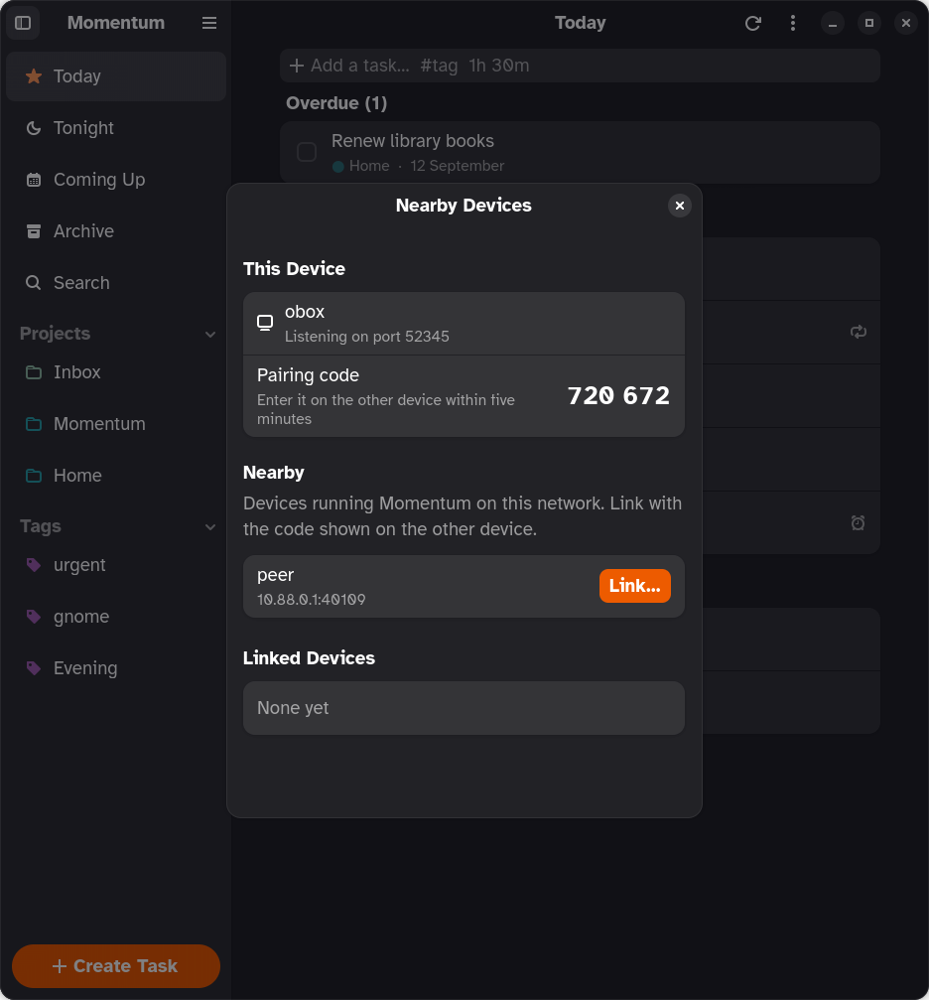

<p align="center">
  
</p>

<h1 align="center">Momentum</h1>

<p align="center">
  <strong>Plan your day. A native GNOME task planner that syncs with Super Productivity.</strong>
</p>

<p align="center">
  <a href="https://github.com/dan-hart/momentum/actions/workflows/ci.yml"></a>
  <a href="LICENSE"></a>
  
  
</p>

<p align="center">
  
</p>

Momentum is what [Super Productivity](https://super-productivity.com) would look like if it
had been written for GNOME: a fast Rust app built on GTK 4 and libadwaita, following the
Human Interface Guidelines, respecting your accent color, and staying out of your way.

It reads, writes and syncs **the same data** as Super Productivity through a shared
Nextcloud folder, so you can keep using the desktop, Android and iOS apps and switch to
Momentum whenever you are on your Linux machine.

## Highlights

- **Today, Morning, Tonight, Coming Up, projects and tags.** Today is the plan, with a
  morning section for tasks tagged "Morning" and an evening one for "Evening"; those two
  sidebar entries appear only on days that use them. Coming Up shows the next 7 or 30 days grouped by day. Every project and tag is one click away in the sidebar.
- **Guided task creation.** Title, project, due day with a calendar, estimate, tag chips
  and notes in one dialog. Or type `Fix the bug #work 1h 30m` into the quick-add box, with
  `#` autocomplete for your tags.
- **Repeating tasks.** Create and edit daily, weekly, monthly and yearly schedules, and the
  ones from Super Productivity spawn their instances here too, badged with a plain-language
  "Repeats every Monday".
- **Sync you can trust.** Compatible with Super Productivity's `sync-data.json`, including
  end-to-end encrypted files. Conflicts are resolved by rebasing your changes, never by
  overwriting. Secrets live in the system keyring.
- **Or no server at all.** Link two devices once with a six-digit code and they sync
  directly over the local network, end-to-end encrypted, seconds after a change. A device
  that also has Nextcloud relays for the others.
- **Times, reminders, overdue.** Give a task a time and a reminder; what slipped waits
  under an Overdue heading, and a repeating task you missed still shows up, dated the day
  it was due.
- **Fast search over everything.** Tasks, notes, subtasks, the archive, projects and tags,
  grouped and instant.
- **Drag and drop, multi-select, bulk edit.** Drop a task on a project, a tag, Today or
  Tonight. Ctrl+click or the select toggle to pick several, then drag them together or
  mark done, plan, move, tag or delete them in one go, with a single Undo.
- **Keyboard first.** Standard GNOME shortcuts, a shortcuts dialog, context menus on
  everything, and system-wide shortcuts through the GlobalShortcuts portal.
- **Undo, not confirmation.** Delete, done, archive, moves and tag drops all get an Undo
  toast.
- **Native, adaptive, accessible.** Sidebar collapses on narrow windows, light and dark
  follow the system, accent color follows your setting, controls carry accessible labels.

<p align="center">
  
  
</p>

## Install

**One click:** open [dan-hart.github.io/momentum](https://dan-hart.github.io/momentum/) and press
Install. GNOME Software or KDE Discover adds Momentum's repository and keeps it updated.

**Terminal:**

```sh
flatpak install --user https://dan-hart.github.io/momentum/momentum.flatpakref
```

Momentum publishes to its own signed Flatpak repository for x86_64 and aarch64, so it
works on any distribution with Flatpak: GNOME, KDE Plasma, Sway and the rest. Standalone
`.flatpak` bundles are also attached to each
[release](https://github.com/dan-hart/momentum/releases/latest) for offline installs.

### Set up sync

1. In Super Productivity, note the Nextcloud folder and encryption password you use.
2. In Momentum, press <kbd>Ctrl</kbd>+<kbd>,</kbd>, turn on **Sync with Nextcloud**, and
   enter the server URL, username, an app password (Nextcloud → Settings → Security), the
   folder, and the encryption password.
3. Press <kbd>Ctrl</kbd>+<kbd>R</kbd>. The first sync only downloads, so it is safe to try.

The last sync time shows under the task list. Sync also runs at startup and every five
minutes while the switch is on.

### Sync with nearby devices

No server? Preferences › Nearby Devices › **Sync with nearby devices** on two machines,
open **Manage Devices…** on both, and type one device's six-digit code on the other. From
then on changes travel directly over the local network, end-to-end encrypted, a few
seconds after you make them. A device that also has Nextcloud relays what it receives, so
the rest of your devices and Super Productivity stay in step. Details in
[docs/P2P.md](docs/P2P.md).

## Part of the desktop

- **Search from the shell.** Type a task name in GNOME's Activities overview or KDE's KRunner
  to find it or create it. Momentum registers a GNOME search provider and a KRunner plugin.
- **Notifications you can act on.** Reminders have Done and Snooze buttons, and a morning
  summary tells you what the day holds.
- **Runs in the background.** Turn it on in Preferences: reminders and sync keep going when
  the window closes, Momentum starts at login, and GNOME's Background Apps menu shows what is
  due today. All through the Background portal, so you stay in control.
- **Launcher actions.** Right-click the app icon for New Task, Today and Search.
- **Quick-add window.** Ctrl+Alt+T from anywhere opens a one-line window; type, Enter, done.
- **Drop and paste.** Drag a link or some text from another app onto the list to make a task;
  paste several lines into the add box to create several tasks.
- **Links and scripts.** `momentum --add "Call the bank"` from a script, or open
  `momentum://add?title=Call%20the%20bank` and Super Productivity's
  `superproductivity://create-task` links.
- **Global undo.** Ctrl+Z reverses the last change, even after its toast is gone.

## The `mo` command line

`mo` works on Linux and macOS and reads the same data as the app. On Linux, while the app
is running, changes are handed to it over D-Bus so nothing is written behind its back.

```sh
cargo install --path crates/mo        # or: flatpak run --command=mo io.github.dan_hart.Momentum …

mo add "Call the bank #admin 15m" --today
mo add "Prep slides" --project Work --tomorrow
mo today            mo tonight            mo upcoming --days 14
mo list Work        mo list "#admin"       mo search bank
mo done bank        mo plan slides         mo rm 01a0835a
mo projects         mo tags               mo sync
mo config --server https://cloud.example.com --user dan --folder super-productivity --password
```

Add `--json` for machine-readable output. Set `MO_DATA_DIR` to point at another store.

## Keyboard shortcuts

Ctrl is the default modifier. Preferences › Desktop › **Modifier key** switches every
shortcut below to Alt or Super (Option or Command on macOS), so Ctrl+E becomes Super+E.

| Shortcut | Action |
|---|---|
| <kbd>Ctrl</kbd>+<kbd>N</kbd> | New task |
| <kbd>Ctrl</kbd>+<kbd>Shift</kbd>+<kbd>N</kbd> | New project |
| <kbd>Ctrl</kbd>+<kbd>Shift</kbd>+<kbd>M</kbd> | Move task to the morning / back to today |
| <kbd>Ctrl</kbd>+<kbd>F</kbd> | Search |
| <kbd>Ctrl</kbd>+<kbd>D</kbd> | Mark focused task done / not done |
| <kbd>Ctrl</kbd>+<kbd>T</kbd> | Plan focused task for today |
| <kbd>Ctrl</kbd>+<kbd>Shift</kbd>+<kbd>T</kbd> | Move between Today and Tonight |
| <kbd>Ctrl</kbd>+<kbd>Shift</kbd>+<kbd>→</kbd> | Move to tomorrow |
| <kbd>Ctrl</kbd>+<kbd>Shift</kbd>+<kbd>↓</kbd> | Move to next week (Monday) |
| <kbd>Ctrl</kbd>+<kbd>Shift</kbd>+<kbd>R</kbd> | Repeat schedule |
| <kbd>Ctrl</kbd>+<kbd>Z</kbd> | Undo the last change |
| <kbd>Ctrl</kbd>+<kbd>M</kbd> | Move focused task to a project |
| <kbd>Delete</kbd> | Delete focused task |
| <kbd>Ctrl</kbd>+<kbd>A</kbd> | Select all tasks in the view |
| <kbd>Ctrl</kbd>+<kbd>E</kbd> | Archive completed tasks |
| <kbd>Ctrl</kbd>+<kbd>Up</kbd> / <kbd>Ctrl</kbd>+<kbd>Down</kbd> | Move focused task up / down (Manual Order) |
| <kbd>Ctrl</kbd>+<kbd>Shift</kbd>+<kbd>D</kbd> | Duplicate focused task |
| <kbd>Ctrl</kbd>+<kbd>Shift</kbd>+<kbd>C</kbd> | Copy focused task title |
| <kbd>Ctrl</kbd>+<kbd>O</kbd> | Open focused task details |
| <kbd>Ctrl</kbd>+<kbd>Shift</kbd>+<kbd>A</kbd> | Clear selection |
| <kbd>Ctrl</kbd>+<kbd>L</kbd> | Focus the quick-add box |
| <kbd>F9</kbd> | Show or hide the sidebar |
| <kbd>Ctrl</kbd>+<kbd>PageDown</kbd> / <kbd>Ctrl</kbd>+<kbd>PageUp</kbd> | Next / previous view |
| <kbd>Alt</kbd>+<kbd>1</kbd>…<kbd>9</kbd> | Jump to a sidebar entry |
| <kbd>Ctrl</kbd>+<kbd>R</kbd> / <kbd>F5</kbd> | Sync now |
| <kbd>Ctrl</kbd>+<kbd>,</kbd> | Preferences |
| <kbd>Ctrl</kbd>+<kbd>?</kbd> | All shortcuts |
| <kbd>Ctrl</kbd>+<kbd>Alt</kbd>+<kbd>T</kbd> | System-wide: add a task from anywhere |

## Build from source

Momentum builds as a Flatpak against the GNOME 50 SDK. You need `flatpak` and the
`org.flatpak.Builder` app.

```sh
flatpak install --user flathub org.gnome.Sdk//50 org.gnome.Platform//50 \
  org.freedesktop.Sdk.Extension.rust-stable//25.08 \
  org.freedesktop.Sdk.Extension.llvm22//25.08 org.flatpak.Builder

# Nearby-device sync links against LibreSync, checked out next to the workspace
git clone https://github.com/dan-hart/LibreSync ../LibreSync && ln -s ../LibreSync libresync-src

# Development build (striped header, debug logging, separate data)
flatpak run org.flatpak.Builder --user --install --force-clean flatpak_app \
  build-aux/io.github.dan_hart.Momentum.Devel.json
flatpak run io.github.dan_hart.Momentum.Devel

# Release build
flatpak run org.flatpak.Builder --user --install --force-clean flatpak_app_release \
  build-aux/io.github.dan_hart.Momentum.json
```

Or open the folder in GNOME Builder and press Run.

### Repository layout

| Path | What |
|---|---|
| `crates/app` | GTK 4 + libadwaita application |
| `crates/sp-model` | Super Productivity data model, schema v4 |
| `crates/sp-oplog` | Operation log: envelope, vector clocks, action codes, `apply()` |
| `crates/sp-store` | Local persistence (JSON snapshot, pending ops, sync metadata) |
| `crates/sp-sync` | Nextcloud WebDAV sync, gzip, Argon2id + AES-GCM encryption |
| `crates/sp-p2p` | Sync with nearby devices over LibreSync (ops as records, bootstrap snapshot) |
| `data/` | Desktop file, metainfo, GSettings schema, icons, Blueprint UI |
| `build-aux/` | Flatpak manifests, Flathub files, mock WebDAV server |
| `docs/PLAN.md` | Architecture and roadmap |
| `docs/MVP.md` | Feature and data-model spec, kept platform-neutral for ports |
| `docs/TRANSLATING.md`, `docs/ACCESSIBILITY.md` | Translator and accessibility guides |

### Run the tests

```sh
build-aux/test.sh                            # everything, headless, inside the SDK sandbox
cargo test --workspace --exclude momentum    # core crates on any OS
```

Model, op log, store, sync, p2p and the `mo` CLI are plain Rust tests; the app's window
tests run on a Broadway display so they work in CI. See [docs/TESTING.md](docs/TESTING.md).

### Test sync without a server

The sync tests start an in-process WebDAV stand-in (`crates/sp-sync/src/mock_dav.rs`),
so `cargo test -p sp-sync` covers first upload, convergence of two clients, conflict
retry and encryption with nothing else running.

### Reproducible screenshots

```sh
MOMENTUM_DEMO=1 MOMENTUM_SCREENSHOT=$PWD/data/resources/screenshots/today.png \
  flatpak run io.github.dan_hart.Momentum.Devel
```

Add `MOMENTUM_SCREENSHOT_DIALOG=1`, `MOMENTUM_SCREENSHOT_UPCOMING=1` or
`MOMENTUM_SCREENSHOT_SEARCH=query` for the other views, `MOMENTUM_SCREENSHOT_DEVICES=1` with
`MOMENTUM_SCREENSHOT_DELAY=8` for the Nearby Devices dialog. Demo mode never syncs (the
devices screenshot runs a node in the demo's temporary directory only).

## How it works with Super Productivity

Super Productivity keeps an operation log: every change is an op with a vector clock, and
all clients converge by applying each other's ops. Momentum speaks that format. Locally it
keeps a snapshot plus its own pending ops; on sync it downloads the remote file, rebases
its pending ops onto the remote snapshot, and uploads with an ETag compare-and-swap. Other
clients then apply Momentum's ops through their normal reducers.

What is intentionally left out: time tracking, pomodoro, boards, metrics, issue providers
and standalone notes. Their data survives untouched in the sync file.

## Contributing

Issues and pull requests are welcome. Read [CONTRIBUTING.md](CONTRIBUTING.md) for the
house rules, and the [Code of Conduct](CODE_OF_CONDUCT.md). Security reports go to the
address in [SECURITY.md](SECURITY.md).

**Translations** happen on [Weblate](https://hosted.weblate.org/projects/momentum/) or by
sending a `.po` file; see [docs/TRANSLATING.md](docs/TRANSLATING.md).

**Accessibility** is a requirement, not a feature: every control is named for Orca, high
contrast turns colour coding off, and everything works from the keyboard. How that is
checked is in [docs/ACCESSIBILITY.md](docs/ACCESSIBILITY.md).

## License

Momentum is free software under the
[GNU General Public License v3.0 or later](LICENSE). It implements the data model and sync
protocol of Super Productivity, Copyright (c) 2018 Johannes Millan, MIT License; see
[NOTICE.md](NOTICE.md). Momentum is an independent project, not affiliated with Super
Productivity.
