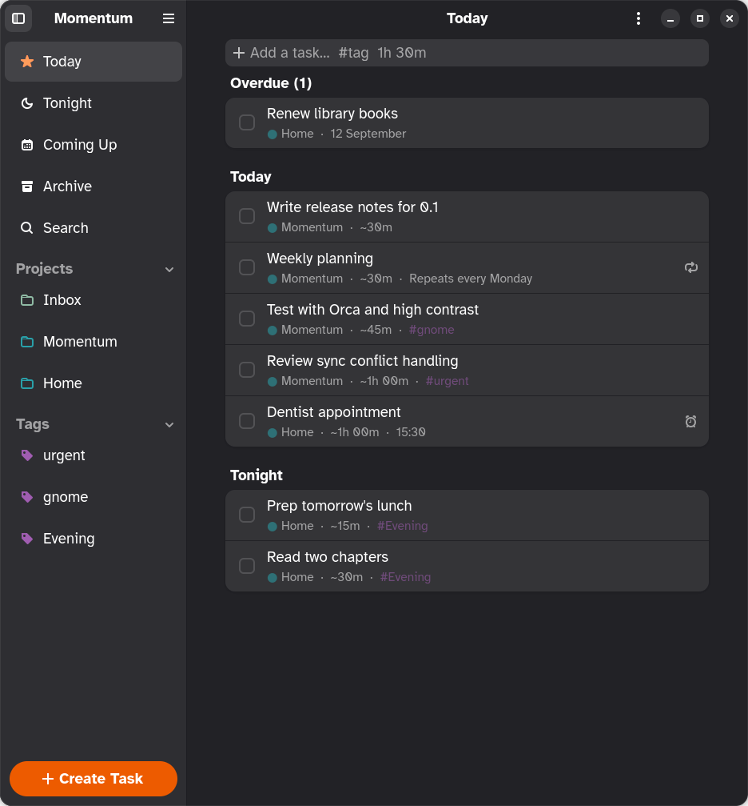
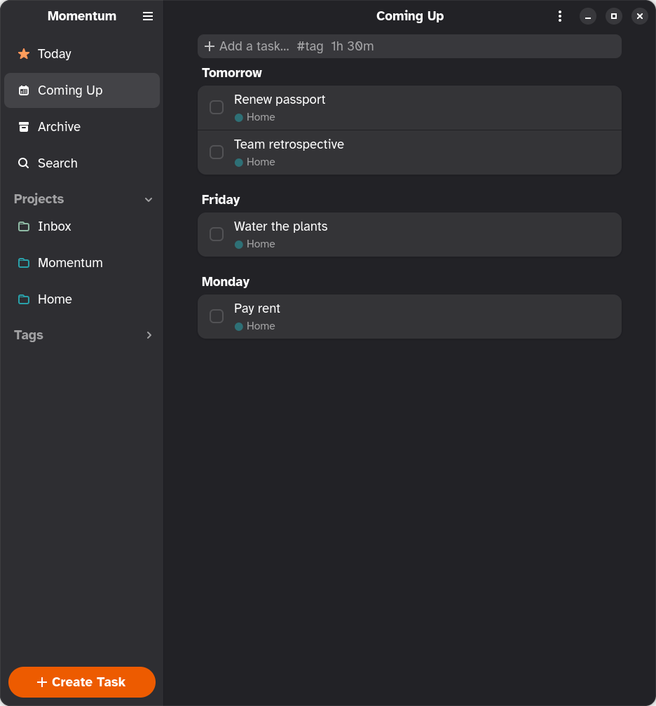
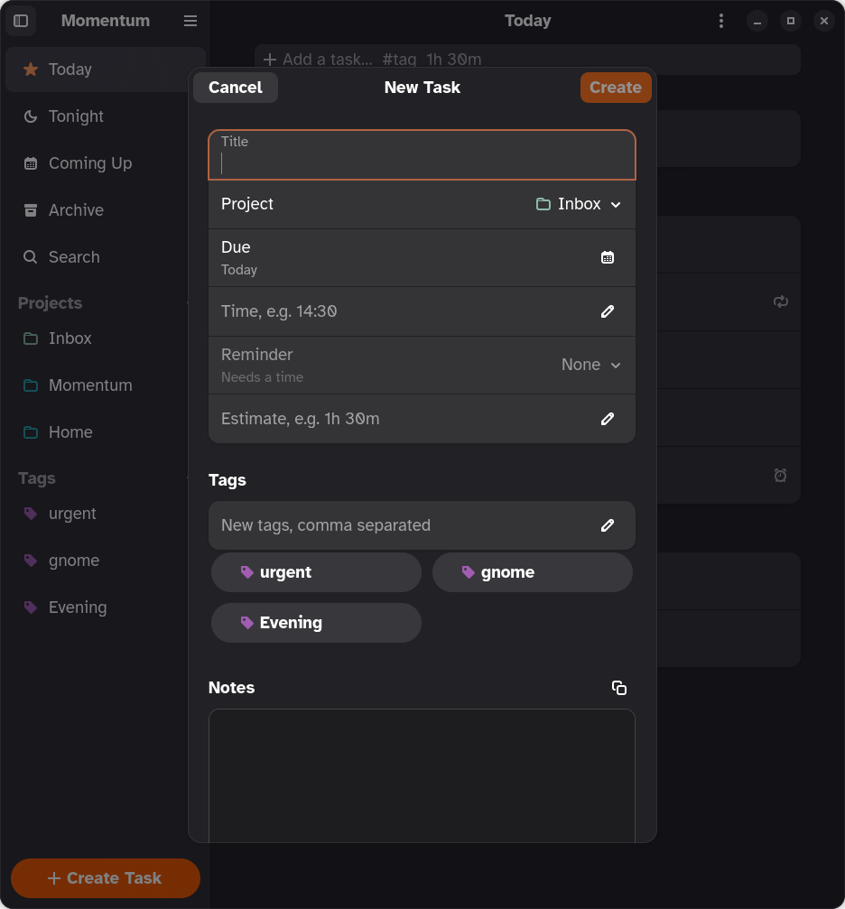

<p align="center">
  
</p>

<h1 align="center">Momentum</h1>

<p align="center">
  <strong>Plan your day. A native GNOME task planner that syncs with Super Productivity.</strong>
</p>

<p align="center">
  <a href="https://github.com/dan-hart/momentum/actions/workflows/ci.yml"></a>
  <a href="LICENSE"></a>
  
  
</p>

<p align="center">
  
</p>

Momentum is what [Super Productivity](https://super-productivity.com) would look like if it
had been written for GNOME: a fast Rust app built on GTK 4 and libadwaita, following the
Human Interface Guidelines, respecting your accent color, and staying out of your way.

It reads, writes and syncs **the same data** as Super Productivity through a shared
Nextcloud folder, so you can keep using the desktop, Android and iOS apps and switch to
Momentum whenever you are on your Linux machine.

## Highlights

- **Today, Tonight, Coming Up, projects and tags.** Today is the plan, with an evening
  section for tasks tagged "Evening". Coming Up shows the next 7 or 30 days grouped by day. Every project and tag is one click away in the sidebar.
- **Guided task creation.** Title, project, due day with a calendar, estimate, tag chips
  and notes in one dialog. Or type `Fix the bug #work 1h 30m` into the quick-add box, with
  `#` autocomplete for your tags.
- **Repeating tasks.** Daily, weekly, monthly and yearly schedules from Super Productivity
  spawn their instances here too, badged with a plain-language "Repeats every Monday".
- **Sync you can trust.** Compatible with Super Productivity's `sync-data.json`, including
  end-to-end encrypted files. Conflicts are resolved by rebasing your changes, never by
  overwriting. Secrets live in the system keyring.
- **Fast search over everything.** Tasks, notes, subtasks, the archive, projects and tags,
  grouped and instant.
- **Drag and drop, multi-select, bulk edit.** Drop a task on a project, a tag, Today or
  Tonight. Ctrl+click or the select toggle to pick several, then drag them together or
  mark done, plan, move, tag or delete them in one go, with a single Undo.
- **Keyboard first.** Standard GNOME shortcuts, a shortcuts dialog, context menus on
  everything, and system-wide shortcuts through the GlobalShortcuts portal.
- **Undo, not confirmation.** Delete, done, archive, moves and tag drops all get an Undo
  toast.
- **Native, adaptive, accessible.** Sidebar collapses on narrow windows, light and dark
  follow the system, accent color follows your setting, controls carry accessible labels.

<p align="center">
  
  
</p>

## Install

Momentum is not on Flathub yet. Until then, grab a bundle from the
[latest release](https://github.com/dan-hart/momentum/releases/latest) and install it:

```sh
flatpak install --user momentum-*-x86_64.flatpak
flatpak run io.github.dan_hart.Momentum
```

Bundles are built for x86_64 and aarch64. Momentum runs on any desktop that ships the
XDG portals: GNOME, KDE Plasma, Sway and others.

### Set up sync

1. In Super Productivity, note the Nextcloud folder and encryption password you use.
2. In Momentum, press <kbd>Ctrl</kbd>+<kbd>,</kbd>, turn on **Sync with Nextcloud**, and
   enter the server URL, username, an app password (Nextcloud → Settings → Security), the
   folder, and the encryption password.
3. Press <kbd>Ctrl</kbd>+<kbd>R</kbd>. The first sync only downloads, so it is safe to try.

The last sync time shows under the task list. Sync also runs at startup and every five
minutes while the switch is on.

## Keyboard shortcuts

| Shortcut | Action |
|---|---|
| <kbd>Ctrl</kbd>+<kbd>N</kbd> | New task |
| <kbd>Ctrl</kbd>+<kbd>Shift</kbd>+<kbd>N</kbd> | New project |
| <kbd>Ctrl</kbd>+<kbd>F</kbd> | Search |
| <kbd>Ctrl</kbd>+<kbd>D</kbd> | Mark focused task done / not done |
| <kbd>Ctrl</kbd>+<kbd>T</kbd> | Plan focused task for today |
| <kbd>Ctrl</kbd>+<kbd>Shift</kbd>+<kbd>T</kbd> | Move between Today and Tonight |
| <kbd>Ctrl</kbd>+<kbd>M</kbd> | Move focused task to a project |
| <kbd>Delete</kbd> | Delete focused task |
| <kbd>Ctrl</kbd>+<kbd>A</kbd> | Select all tasks in the view |
| <kbd>Alt</kbd>+<kbd>1</kbd>…<kbd>9</kbd> | Jump to a sidebar entry |
| <kbd>Ctrl</kbd>+<kbd>R</kbd> / <kbd>F5</kbd> | Sync now |
| <kbd>Ctrl</kbd>+<kbd>,</kbd> | Preferences |
| <kbd>Ctrl</kbd>+<kbd>?</kbd> | All shortcuts |
| <kbd>Ctrl</kbd>+<kbd>Alt</kbd>+<kbd>T</kbd> | System-wide: add a task from anywhere |

## Build from source

Momentum builds as a Flatpak against the GNOME 50 SDK. You need `flatpak` and the
`org.flatpak.Builder` app.

```sh
flatpak install --user flathub org.gnome.Sdk//50 org.gnome.Platform//50 \
  org.freedesktop.Sdk.Extension.rust-stable//25.08 \
  org.freedesktop.Sdk.Extension.llvm22//25.08 org.flatpak.Builder

# Development build (striped header, debug logging, separate data)
flatpak run org.flatpak.Builder --user --install --force-clean flatpak_app \
  build-aux/io.github.dan_hart.Momentum.Devel.json
flatpak run io.github.dan_hart.Momentum.Devel

# Release build
flatpak run org.flatpak.Builder --user --install --force-clean flatpak_app_release \
  build-aux/io.github.dan_hart.Momentum.json
```

Or open the folder in GNOME Builder and press Run.

### Repository layout

| Path | What |
|---|---|
| `crates/app` | GTK 4 + libadwaita application |
| `crates/sp-model` | Super Productivity data model, schema v4 |
| `crates/sp-oplog` | Operation log: envelope, vector clocks, action codes, `apply()` |
| `crates/sp-store` | Local persistence (JSON snapshot, pending ops, sync metadata) |
| `crates/sp-sync` | Nextcloud WebDAV sync, gzip, Argon2id + AES-GCM encryption |
| `data/` | Desktop file, metainfo, GSettings schema, icons, Blueprint UI |
| `build-aux/` | Flatpak manifests, Flathub files, mock WebDAV server |
| `docs/PLAN.md` | Architecture and roadmap |

### Test sync without a server

```sh
python3 build-aux/mock-webdav.py 8765 &
MOMENTUM_DAV=http://127.0.0.1:8765 cargo test -p sp-sync -- --ignored
```

### Reproducible screenshots

```sh
MOMENTUM_DEMO=1 MOMENTUM_SCREENSHOT=$PWD/data/resources/screenshots/today.png \
  flatpak run io.github.dan_hart.Momentum.Devel
```

Add `MOMENTUM_SCREENSHOT_DIALOG=1`, `MOMENTUM_SCREENSHOT_UPCOMING=1` or
`MOMENTUM_SCREENSHOT_SEARCH=query` for the other views. Demo mode never syncs.

## How it works with Super Productivity

Super Productivity keeps an operation log: every change is an op with a vector clock, and
all clients converge by applying each other's ops. Momentum speaks that format. Locally it
keeps a snapshot plus its own pending ops; on sync it downloads the remote file, rebases
its pending ops onto the remote snapshot, and uploads with an ETag compare-and-swap. Other
clients then apply Momentum's ops through their normal reducers.

What is intentionally left out: time tracking, pomodoro, boards, metrics, issue providers
and standalone notes. Their data survives untouched in the sync file.

## Contributing

Issues and pull requests are welcome. Read [CONTRIBUTING.md](CONTRIBUTING.md) for the
house rules, and the [Code of Conduct](CODE_OF_CONDUCT.md). Security reports go to the
address in [SECURITY.md](SECURITY.md).

## License

Momentum is free software under the
[GNU General Public License v3.0 or later](LICENSE). It implements the data model and sync
protocol of Super Productivity, Copyright (c) 2018 Johannes Millan, MIT License; see
[NOTICE.md](NOTICE.md). Momentum is an independent project, not affiliated with Super
Productivity.
