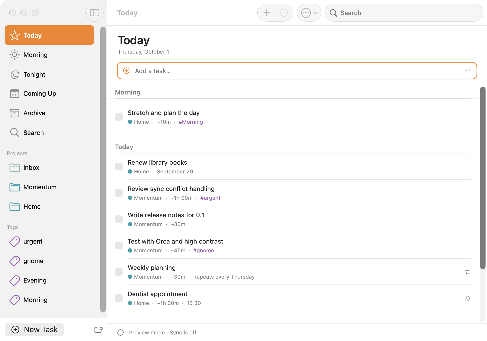
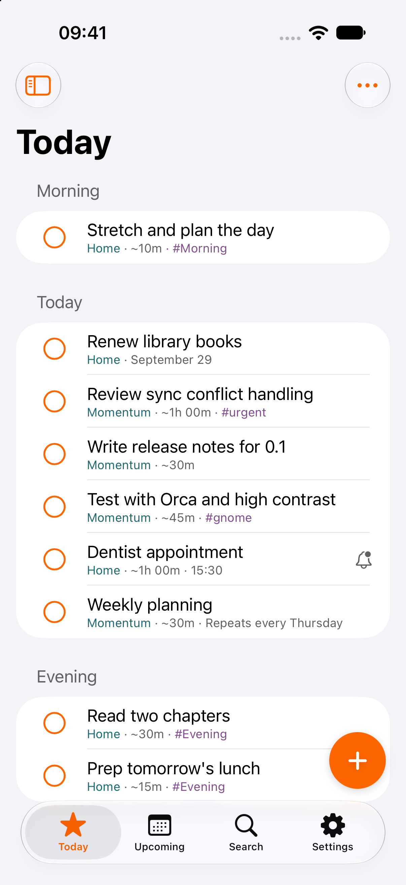
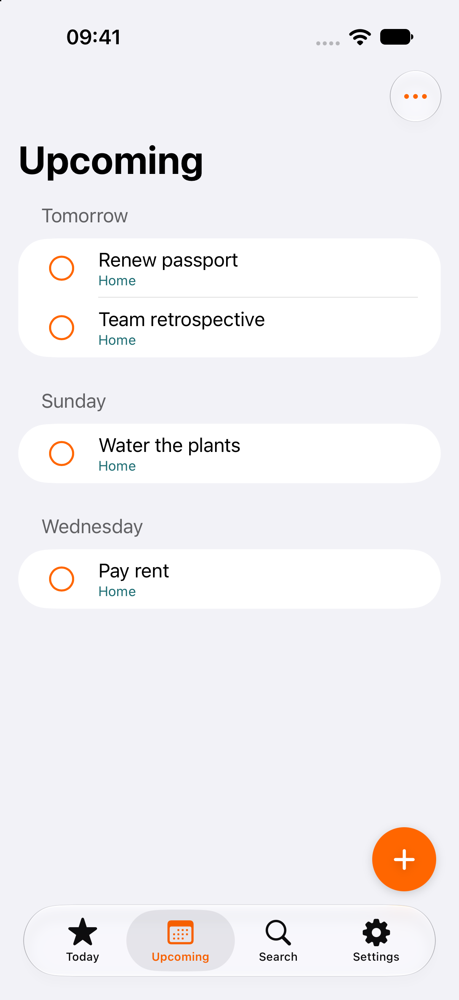
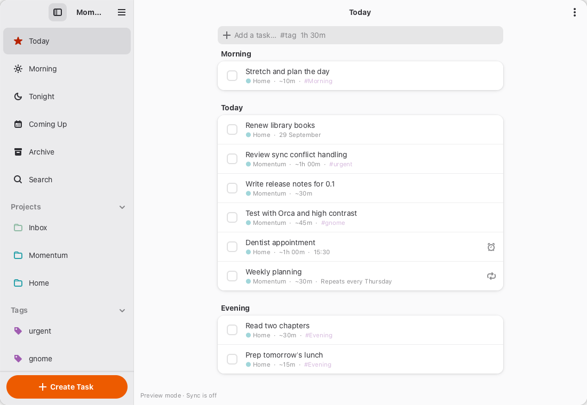
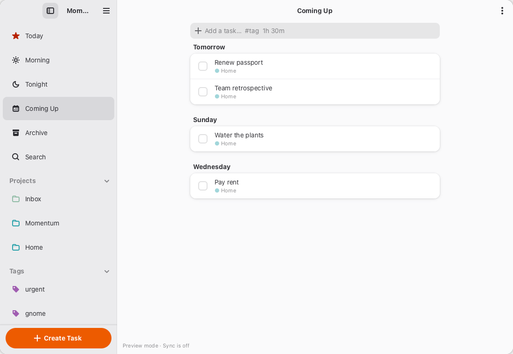
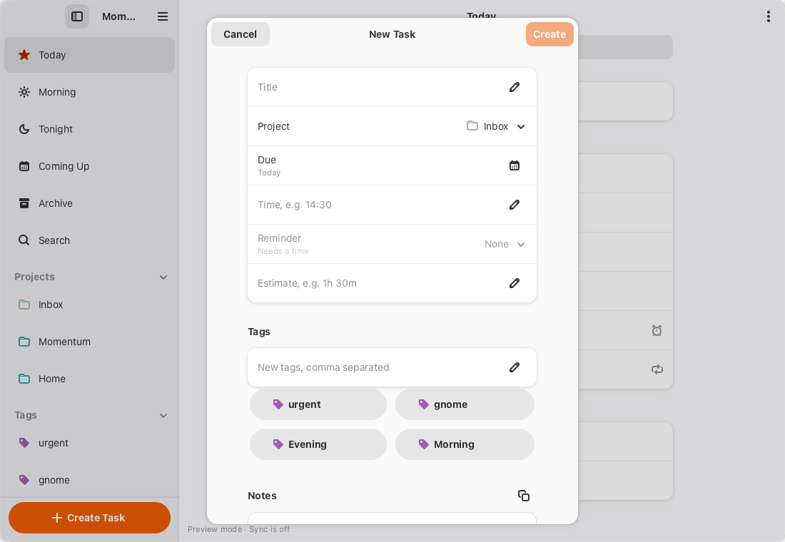

<p align="center">
  
</p>

<h1 align="center">Momentum</h1>

<p align="center">
  <a href="https://github.com/dan-hart/momentum/actions/workflows/ci.yml"></a>
  <a href="LICENSE"></a>
  <a href="crates/momentum-core"></a>
  <a href="macos/README.md"></a>
</p>

<p align="center">
  <a href="#install"></a>
  <a href="macos/README.md"></a>
  <a href="ios/README.md"></a>
</p>

<p align="center">
  <strong>Plan your day. Native task planning, one shared core, and your data under your control.</strong>
</p>

Momentum is an offline-first task planner with native apps for Linux, macOS and
iOS/iPadOS, and Android planned. Core task management works without an account or
internet connection. One Rust engine owns task rules, queries, persistence,
recurrence, undo and sync; each app owns its native interface and system
integrations.

Momentum is GPL-3.0-or-later and remains free to build, compile, self-host and use
from source. There are no ads, tracking or analytics. Pricing for future official
distributions is undecided; no subscription or tipping integration is implemented.

## Previews

Captured on **October 1, 2026** from the 0.4.5 sources with the built-in sample data in
**preview mode**, sync off, light appearance. They are development builds, not a claim
of completed parity or accessibility acceptance. Capture details, including how the
Linux views were rendered on a Mac, are in the
[screenshot notes](data/resources/screenshots/README.md).

### macOS

<p align="center">
  
</p>

### iOS

<p align="center">
  
  &nbsp;&nbsp;
  
</p>

### Linux

<p align="center">
  
</p>

<p align="center">
  
  &nbsp;
  
</p>

## Platform status · October 1, 2026

| Platform | Native app | Current status |
|---|---|---|
| Linux | Rust, GTK 4 and libadwaita | Established. Ships as a signed Flatpak repository and bundles from every release. GTK UI tests run headless in CI; the app also builds and runs natively on a Mac for development. |
| macOS | SwiftUI with AppKit and system services | Established. Single main window, customizable toolbar, multi-item drag, menu bar item, Spotlight, Shortcuts, Keychain and the bundled `mo`. Distributed as a signed zip on every release. |
| iOS / iPadOS | Swift and SwiftUI through UniFFI | Native app for iOS 26 and 27 with Today, Upcoming, Search and Settings, Nextcloud and LibreSync, background sync and the Shortcuts actions. Built from source and tested on a real iPhone; no store distribution yet. |
| Android | Planned native frontend to the same Rust core | No app implementation yet. |

The [feature ledger](docs/FEATURES.md), [known issues](docs/BUGS.md) and
[progress log](docs/PROGRESS.md) distinguish implementation from verification, per
platform. The [iOS parity checklist](docs/IOS-PARITY-CHECKLIST.md) lists what the iOS
app still lacks against the desktop baseline.

## What's new in 0.4

The [changelog](CHANGELOG.md) has every release. Since 0.4.0:

- **Sync that survives bad connections.** Every upload carries a checksum and expected
  length, the stored size is read back, and a cut-off transfer is reported rather than
  trusted. A large sync file over a slow or relayed link gets minutes, not seconds.
- **Sync failures in plain words.** "The copy on the server is damaged", "Sync took
  too long to finish", "The encryption password doesn't match": one sentence, what to
  do, the technical message behind Details, and a working Try Again. A damaged server
  copy can be replaced from the device that has your latest tasks.
- **Every list on every platform:** Coming Up grouped by day; Morning, then Today,
  then Evening in the default grouping; a Move To menu with the next weekdays by name;
  a Compact layout; and View Options on each iOS list.
- **macOS:** a customizable toolbar, one main window, dragging a whole selection at
  once, and sync that keeps running in the background by choice.
- **iOS:** pull to refresh, background sync, Liquid Glass headers, a sync status badge
  in the toolbar, a round Add button, and the sidebar beside the list in landscape on
  larger iPhones.

## How it is built

- **Share behavior, keep interfaces native.** Linux calls the Rust engine directly;
  Apple apps use generated UniFFI bindings and a reusable Swift package for wording and
  preferences. Layout, navigation, gestures, accessibility and OS services belong to
  each platform. No web views, no cross-platform UI toolkit.
- **One grouping layer.** Morning & Night is the default; project, first tag, time
  estimate or None replaces it. Coming Up is always one section per day. Completed
  tasks stay separate. See [Grouping](docs/GROUPING.md).
- **Optional sync, one provider at a time.** Off, Nextcloud or LibreSync. Only the
  selected provider runs; switching preserves tasks and saved connections. Secrets live
  in the platform keychain. Sync compatibility with Super Productivity's file format
  and encryption is preserved while a future independent format stays undecided.
- **Privacy by construction.** No ads, tracking or analytics. Preview mode uses sample
  data in a temporary directory and never starts a transport.
- **Accessibility is required and still being verified.** The
  [accessibility guide](docs/ACCESSIBILITY.md) and the
  [iOS audit](docs/audits/2026-09-16-ios-accessibility.md) record the approach and the
  remaining gaps; a passing build is not acceptance.
- **Free to build and self-host.** GPL-3.0-or-later. Pricing for official
  distributions, subscriptions and tipping are future ideas with nothing decided and no
  billing code in the tree.

## Task-planning highlights

These describe the desktop baseline; the iOS app covers most of it with native
equivalents. The [feature ledger](docs/FEATURES.md) gives exact per-platform scope.

- **Today, Morning, Tonight, Coming Up, projects and tags.** Today is the plan: Morning
  first, then Today, then Evening in the default grouping, from the "Morning" and
  "Evening" tags. Those sidebar entries appear only on days that use them. Coming Up
  shows the next 7 or 30 days, one section per day. Projects and tags are one click
  away in the sidebar.
- **Guided task creation.** Title, project, due day with a calendar, estimate, tag chips
  and notes in one dialog. Or type `Fix the bug #work 1h 30m` into the quick-add box, with
  `#` autocomplete for your tags.
- **Repeating tasks.** Create and edit daily, weekly, monthly and yearly schedules, and the
  ones from Super Productivity spawn their instances here too, badged with a plain-language
  "Repeats every Monday".
- **Sync you can trust.** Compatible with Super Productivity's `sync-data.json`, including
  end-to-end encrypted files. Conflicts are resolved by rebasing your changes, never by
  overwriting. Secrets live in the system keyring.
- **Or no server at all.** Link two devices once with a six-digit code and they sync
  directly over the local network, end-to-end encrypted, seconds after a change. Choose LibreSync as your
  sync provider; switching back to Nextcloud preserves your tasks and connections.
- **Times, reminders, overdue.** Give a task a time and a reminder; what slipped waits
  under an Overdue heading, and a repeating task you missed still shows up, dated the day
  it was due.
- **Fast search over everything.** Tasks, notes, subtasks, the archive, projects and tags,
  grouped and instant.
- **Drag and drop, multi-select, bulk edit.** Drop a task on a project, a tag, Today or
  Tonight. Ctrl+click or the select toggle to pick several, then drag them together or
  mark done, plan, move, tag or delete them in one go, with a single Undo. The context
  menu's Move To offers Morning or Tonight, Tomorrow, the next two weekdays by name,
  Next Week and a project.
- **Regular or Compact rows.** View Options › Layout tightens every list when you want
  more on screen.
- **Keyboard first.** Standard GNOME shortcuts, a shortcuts dialog, context menus on
  everything, and system-wide shortcuts through the GlobalShortcuts portal.
- **Undo, not confirmation.** Delete, done, archive, moves and tag drops all get an Undo
  toast. Prefer a clean list? Turn on "Archive completed tasks immediately" in
  Preferences and completed tasks go straight to the archive.
- **Native, adaptive, accessible.** Sidebar collapses on narrow windows, light and dark
  follow the system, accent color follows your setting, controls carry accessible labels,
  and Preferences offers a native font chooser with separate content and interface sizes.

## Install

### macOS

```sh
brew install --cask dan-hart/tap/momentum
```

The cask installs the app and puts its `mo` command line on your PATH. The same
`Momentum-vX.Y.Z-macos.zip` is attached to every
[release](https://github.com/dan-hart/momentum/releases/latest), which is always the
newest build; the cask can lag a release until the tap is updated. Momentum needs
macOS 26.
To build it yourself instead (Xcode 27 and a Rust toolchain):

```sh
brew install xcodegen
cd macos && xcodegen generate && open Momentum.xcodeproj
```

### iOS / iPadOS

Build from source with Xcode 27, XcodeGen and the Rust iOS targets. The minimum
deployment target is iOS/iPadOS 26. See the [iOS build guide](ios/README.md) for
device/simulator builds and signing. Release readiness is tracked in the parity
checklist; a development build does not establish feature parity.

### Linux

**One click:** open [dan-hart.github.io/momentum](https://dan-hart.github.io/momentum/) and press
Install. GNOME Software or KDE Discover adds Momentum's repository and keeps it updated.

**Terminal:**

```sh
flatpak install --user https://dan-hart.github.io/momentum/momentum.flatpakref
```

Momentum publishes to its own signed Flatpak repository for x86_64 and aarch64, so it
works on any distribution with Flatpak: GNOME, KDE Plasma, Sway and the rest. Standalone
`.flatpak` bundles are also attached to each
[release](https://github.com/dan-hart/momentum/releases/latest) for offline installs.

### The `mo` command line on its own

```sh
brew install dan-hart/tap/momentum-cli       # macOS or Linux; prebuilt, no toolchain needed
```

On macOS the app already includes `mo`, so install one or the other. Every release also
attaches `mo-vX.Y.Z-{macos-universal,linux-x86_64,linux-aarch64}.tar.gz`.

### Set up sync

1. In Super Productivity, note the Nextcloud folder and encryption password you use.
2. In Momentum, press <kbd>Ctrl</kbd>+<kbd>,</kbd>, choose **Sync → Nextcloud**, and
   enter the server URL, username, an app password (Nextcloud → Settings → Security), the
   folder, and the encryption password.
3. Press <kbd>Ctrl</kbd>+<kbd>R</kbd>. The first sync only downloads, so it is safe to try.

The last sync time shows under the task list. Automatic sync uploads edits ten seconds
after they settle, polls every two and a half minutes while the switch is on, and
runs at startup.

**When sync fails,** the app says what went wrong in one sentence and what to do, and
keeps the technical message behind Details. If no device can read the copy on the
server, choose **Replace Server Copy** on the device with your latest tasks; the
damaged file is kept on the server as `sync-data.json.damaged` and the other devices
re-apply their own pending edits on their next sync. Large sync files travel better
with **Compress the sync file** turned on, especially over a relayed connection.

### Set up iOS sync

In **Settings → Sync**, choose **Sync Provider → Nextcloud**. Enter your server URL,
username, app password and sync folder, then choose **Save Connection**. Use the same
folder and encryption password on every device. Remote servers require HTTPS; HTTP is
accepted only for an isolated localhost fixture. **Sync Now**, last successful sync,
pending changes and error recovery are available on this screen.

Automatic sync runs while Momentum is open, and **Sync in the background** lets iOS
wake the app now and then for one exchange. Pull down any list to sync right away. Low
Power Mode pauses automatic checks but keeps Sync Now available. Local changes stay on
the device for the next sync. Choosing **Off** preserves your tasks and saved
connection. See the [iOS sync guide](ios/README.md#nextcloud-sync) for verification
limits.

### Sync desktop devices nearby

No server? Preferences/Settings → Sync → **LibreSync** on two machines,
open **Manage Devices…** on both, and type one device's six-digit code on the other. From
then on changes travel directly over the local network, end-to-end encrypted, a few
seconds after you make them. Only the selected provider runs. Switching to Nextcloud later keeps the received
changes and saved connections. Details in
[docs/P2P.md](docs/P2P.md).

## Linux desktop integration

- **Search from the shell.** Type a task name in GNOME's Activities overview or KDE's KRunner
  to find it or create it. Momentum registers a GNOME search provider and a KRunner plugin.
- **Notifications you can act on.** Reminders have Done and Snooze buttons, and a morning
  summary tells you what the day holds.
- **Runs in the background.** Turn it on in Preferences: reminders and sync keep going when
  the window closes, Momentum starts at login, and GNOME's Background Apps menu can show tasks
  due today, all open tasks in Today (including overdue), or a neutral running status. All
  through the Background portal, so you stay in control.
- **Launcher actions.** Right-click the app icon for New Task, Today and Search.
- **Quick-add window.** Ctrl+Alt+T from anywhere opens a one-line window; type, Enter, done.
- **Drop and paste.** Drag a link or some text from another app onto the list to make a task;
  paste several lines into the add box to create several tasks.
- **Links and scripts.** `momentum --add "Call the bank"` from a script, or open
  `momentum://add?title=Call%20the%20bank` and Super Productivity's
  `superproductivity://create-task` links.
- **Global undo.** Ctrl+Z reverses the last change, even after its toast is gone.

## The `mo` command line

`mo` works on Linux and macOS and reads the same data as the app. On Linux, while the app
is running, changes are handed to it over D-Bus so nothing is written behind its back.
`mo open` is Linux-only; on macOS, use the Momentum **Open Task** Shortcut instead.

```sh
brew install dan-hart/tap/momentum-cli   # or: cargo install --path crates/mo, or flatpak run --command=mo io.github.dan_hart.Momentum …

mo add "Call the bank #admin 15m" --today
mo add "Prep slides" --project Work --tomorrow
mo today            mo tonight            mo upcoming --days 14
mo list Work        mo list "#admin"       mo search bank
mo done bank        mo plan slides         mo rm 01a0835a
mo open bank
mo projects         mo tags               mo sync
mo config --server https://cloud.example.com --user dan --folder super-productivity --password
```

Add `--json` for machine-readable output. Set `MO_DATA_DIR` to point at another store.
For safety, Linux `mo open` accepts only the exact stable or Devel Flatpak store path;
it refuses custom data directories because they cannot be mapped to one app instance.
See [Linux automation](docs/LINUX-AUTOMATION.md) for exact task opening, JSON contracts,
offline/live-app safety rules, native entry points, and their regression-test audit.

## Desktop keyboard shortcuts

Ctrl is the default modifier. Preferences › Desktop › **Modifier key** switches every
shortcut below to Alt or Super (Option or Command on macOS), so Ctrl+E becomes Super+E.

| Shortcut | Action |
|---|---|
| <kbd>Ctrl</kbd>+<kbd>N</kbd> | New task |
| <kbd>Ctrl</kbd>+<kbd>Shift</kbd>+<kbd>N</kbd> | New project |
| <kbd>Ctrl</kbd>+<kbd>Shift</kbd>+<kbd>M</kbd> | Move task to the morning / back to today |
| <kbd>Ctrl</kbd>+<kbd>F</kbd> | Search |
| <kbd>Ctrl</kbd>+<kbd>D</kbd> | Mark focused task done / not done |
| <kbd>Ctrl</kbd>+<kbd>T</kbd> | Plan focused task for today |
| <kbd>Ctrl</kbd>+<kbd>Shift</kbd>+<kbd>T</kbd> | Move between Today and Tonight |
| <kbd>Ctrl</kbd>+<kbd>Shift</kbd>+<kbd>→</kbd> | Move to tomorrow |
| <kbd>Ctrl</kbd>+<kbd>Shift</kbd>+<kbd>↓</kbd> | Move to next week (Monday) |
| <kbd>Ctrl</kbd>+<kbd>Shift</kbd>+<kbd>R</kbd> | Repeat schedule |
| <kbd>Ctrl</kbd>+<kbd>Z</kbd> | Undo the last change |
| <kbd>Ctrl</kbd>+<kbd>M</kbd> | Move focused task to a project |
| <kbd>Delete</kbd> | Delete focused task |
| <kbd>Ctrl</kbd>+<kbd>A</kbd> | Select all tasks in the view |
| <kbd>Ctrl</kbd>+<kbd>E</kbd> | Archive completed tasks |
| <kbd>Ctrl</kbd>+<kbd>Up</kbd> / <kbd>Ctrl</kbd>+<kbd>Down</kbd> | Move focused task up / down (Manual Order) |
| <kbd>Ctrl</kbd>+<kbd>Shift</kbd>+<kbd>D</kbd> | Duplicate focused task |
| <kbd>Ctrl</kbd>+<kbd>Shift</kbd>+<kbd>C</kbd> | Copy focused task title |
| <kbd>Ctrl</kbd>+<kbd>O</kbd> | Open focused task details |
| <kbd>Ctrl</kbd>+<kbd>Shift</kbd>+<kbd>A</kbd> | Clear selection |
| <kbd>Ctrl</kbd>+<kbd>L</kbd> | Focus the quick-add box |
| <kbd>F9</kbd> | Show or hide the sidebar |
| <kbd>Ctrl</kbd>+<kbd>PageDown</kbd> / <kbd>Ctrl</kbd>+<kbd>PageUp</kbd> | Next / previous view |
| <kbd>Alt</kbd>+<kbd>1</kbd>…<kbd>9</kbd> | Jump to a sidebar entry |
| <kbd>Ctrl</kbd>+<kbd>R</kbd> / <kbd>F5</kbd> | Sync now |
| <kbd>Ctrl</kbd>+<kbd>,</kbd> | Preferences |
| <kbd>Ctrl</kbd>+<kbd>?</kbd> | All shortcuts |
| <kbd>Ctrl</kbd>+<kbd>Alt</kbd>+<kbd>T</kbd> | System-wide: add a task from anywhere |

## Build from source

For Apple builds, use the [macOS](macos/README.md) or [iOS](ios/README.md) guide.
The iOS regression suite is unit-only: portable Swift tests cover code and a minimal
simulator host renders the production SwiftUI views with `UIHostingController`. It has
no XCUITest target and does not use ViewInspector; see the
[fast iOS testing guide](ios/TESTING.md).
The Linux app builds as a Flatpak against the GNOME 50 SDK. You need `flatpak` and the
`org.flatpak.Builder` app.

```sh
flatpak install --user flathub org.gnome.Sdk//50 org.gnome.Platform//50 \
  org.freedesktop.Sdk.Extension.rust-stable//25.08 \
  org.freedesktop.Sdk.Extension.llvm22//25.08 org.flatpak.Builder

# Nearby-device sync links against LibreSync, checked out next to the workspace
git clone https://github.com/dan-hart/LibreSync ../LibreSync && ln -s ../LibreSync libresync-src

# Development build (striped header, debug logging, separate data)
flatpak run org.flatpak.Builder --user --install --force-clean flatpak_app \
  build-aux/io.github.dan_hart.Momentum.Devel.json
flatpak run io.github.dan_hart.Momentum.Devel

# Release build
flatpak run org.flatpak.Builder --user --install --force-clean flatpak_app_release \
  build-aux/io.github.dan_hart.Momentum.json
```

Or open the folder in GNOME Builder and press Run. On a Mac, the GTK app also builds
and runs natively against Homebrew's GTK 4 and libadwaita for development; the recipe
is in [docs/TESTING.md](docs/TESTING.md#running-the-linux-app-natively-on-macos).

### Repository layout

| Path | What |
|---|---|
| `crates/momentum-core` | Shared task engine, queries, mutations, undo, notifications and sync orchestration |
| `crates/momentum-ffi` | Generated UniFFI boundary for native clients |
| `crates/app` | Linux GTK 4 + libadwaita application |
| `macos/Momentum` | Native macOS SwiftUI/AppKit app |
| `macos/Packages/MomentumKit` | Reusable Apple wording/preferences and platform-specific adapters |
| `ios/Momentum` | Native SwiftUI iOS/iPadOS app |
| `ios/Packages/MomentumMobile` | Mobile engine coordination, lifecycle and notification support |
| `crates/sp-model` | Super Productivity data model, schema v4 |
| `crates/sp-oplog` | Operation log: envelope, vector clocks, action codes, `apply()` |
| `crates/sp-store` | Local persistence (JSON snapshot, pending ops, sync metadata) |
| `crates/sp-sync` | Nextcloud WebDAV sync, gzip, Argon2id + AES-GCM encryption |
| `crates/sp-p2p` | Sync with nearby devices over LibreSync (ops as records, bootstrap snapshot) |
| `data/` | Desktop file, metainfo, GSettings schema, icons, Blueprint UI |
| `build-aux/` | Flatpak manifests, Flathub files, Homebrew templates, `release.py` (one version everywhere) |
| `docs/PLAN.md` | Architecture and roadmap |
| `docs/MVP.md` | Feature and data-model spec, kept platform-neutral for ports |
| `docs/TRANSLATING.md`, `docs/ACCESSIBILITY.md` | Translator and accessibility guides |
| `docs/RELEASING.md` | How a tag becomes a release on every platform |

### Run the tests

```sh
build-aux/test.sh                            # everything, headless, inside the SDK sandbox
cargo test --workspace --exclude momentum    # core crates on any OS
swift test --package-path macos/Packages/MomentumKit
swift test --package-path ios/Packages/MomentumMobile
```

Model, op log, store, sync, p2p and the `mo` CLI are plain Rust tests; the app's window
tests run on a Broadway display so they work in CI. See [docs/TESTING.md](docs/TESTING.md).

### Test sync without a server

The sync tests start an in-process WebDAV stand-in (`crates/sp-sync/src/mock_dav.rs`),
so `cargo test -p sp-sync` covers first upload, convergence of two clients, conflict
retry and encryption with nothing else running.

### Reproducible screenshots

Apple preview launch and capture commands are in the
[screenshot notes](data/resources/screenshots/README.md). For Linux, the app renders
its own window to a file and quits:

```sh
MOMENTUM_DEMO=1 MOMENTUM_SCREENSHOT=$PWD/data/resources/screenshots/today.png \
  MOMENTUM_SCREENSHOT_SIZE=1100x760 ADW_DEBUG_COLOR_SCHEME=prefer-light \
  flatpak run io.github.dan_hart.Momentum.Devel
```

Add `MOMENTUM_SCREENSHOT_DIALOG=1`, `MOMENTUM_SCREENSHOT_UPCOMING=1` or
`MOMENTUM_SCREENSHOT_SEARCH=query` for the other views. The capture renders as the
active window even when launched from a terminal. Demo mode never syncs.

## How it works with Super Productivity

Super Productivity keeps an operation log: every change is an op with a vector clock, and
all clients converge by applying each other's ops. Momentum speaks that format. Locally it
keeps a snapshot plus its own pending ops; on sync it downloads the remote file, rebases
its pending ops onto the remote snapshot, and uploads with an ETag compare-and-swap. Other
clients then apply Momentum's ops through their normal reducers.

What is intentionally left out: time tracking, pomodoro, boards, metrics, issue providers
and standalone notes. Their data survives untouched in the sync file.

## Contributing

Issues and pull requests are welcome. Read [CONTRIBUTING.md](CONTRIBUTING.md) for the
house rules, and the [Code of Conduct](CODE_OF_CONDUCT.md). Security reports go to the
address in [SECURITY.md](SECURITY.md).

**Translations** happen on [Weblate](https://hosted.weblate.org/projects/momentum/) or by
sending a `.po` file; see [docs/TRANSLATING.md](docs/TRANSLATING.md).

**Accessibility** is a product requirement. Platform acceptance must cover screen
readers, scalable text, contrast, reduced motion and alternative input. The
[accessibility guide](docs/ACCESSIBILITY.md) and
[iOS audit](docs/audits/2026-09-16-ios-accessibility.md) record the approach and
remaining gaps; a successful build or automated traversal is not full acceptance.

## License

Momentum is free software under the
[GNU General Public License v3.0 or later](LICENSE). It implements the data model and sync
protocol of Super Productivity, Copyright (c) 2018 Johannes Millan, MIT License; see
[NOTICE.md](NOTICE.md). Momentum is an independent project, not affiliated with Super
Productivity.

## Support

<a href="https://buymeacoffee.com/codedbydan"></a>
